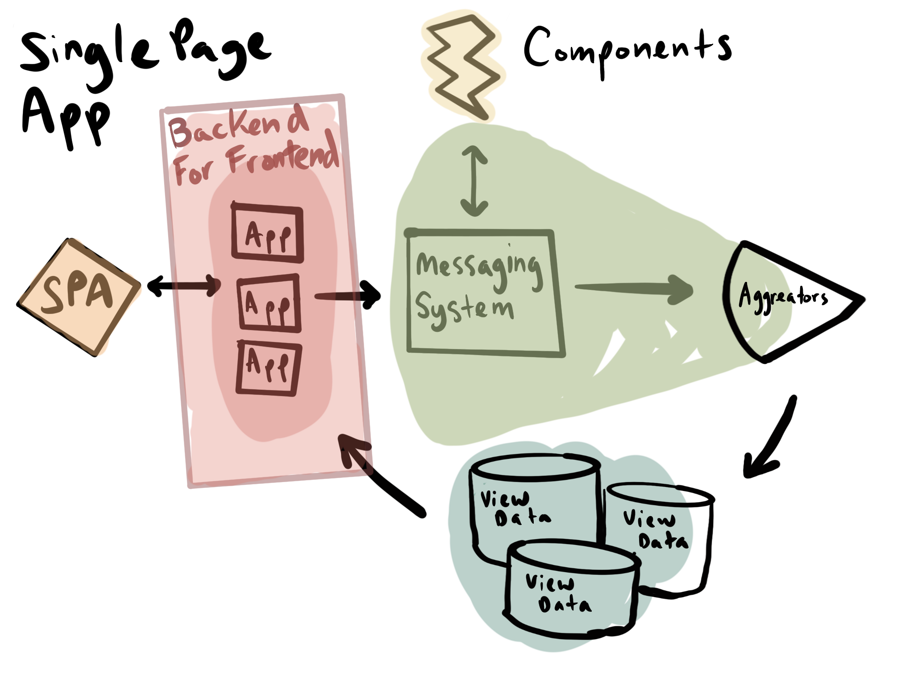

# Common Module for Event-driven Architecture

Designed for Command Query Responsibility Segregation (CQRS) and event sourcing.



## Overview

This package serves as a shared library for all message interfaces, commands and events in the system. It ensures consistency and correctness while implementing the event data model across Applications, Components, Aggregators and various programming languages.

## How it works

Devpie Client's event data model is exported as command and event enums, and message interfaces, to enable easy lookup of the available identifiers in the system.

```typescript
import { Commands, Events } from "@devpie/client-events";

console.log(Commands.RegisterUser);
// RegisterUser

console.log(Events.UserRegistered);
// UserRegistered
```

Existing interfaces allow us to type check the message body being sent, ensuring correctness of implementation.

```typescript
export interface UserRegisteredEvent {
  id: string;
  type: Events.UserRegistered;
  metadata: Metadata;
  data: {
    id: string;
    auth0Id: string;
    email: string;
    emailVerified: boolean;
    firstName: string;
    lastName: string;
    picture: string;
    locale: string;
  };
}
```

## Messaging

Messaging systems allow services to exchange messages without coupling them together. Some services emit messages, while others listen to the messages they subscribe to.

A message is a generic term for data that could be either a command or an event. Commands are messages that trigger something to happen (in the future). Events are messages that notify listeners about something that has happened (in the past). Publishers send commands or events without knowing the consumers that may be listening.

### Language Support

This package is written in TypeScript but converted to additional language targets. Each supported language has its own package.

Supported languages include:

- TypeScript [See package](https://www.npmjs.com/package/@devpie/client-events)
- Golang [See package](https://github.com/ivorscott/devpie-client-events/tree/main/go)
- Python [See package](https://pypi.org/project/devpie-client-events/)

## Development

Modify `src/index.ts`, the source of truth, then re-build to update all packages.

```
npm run build
```
